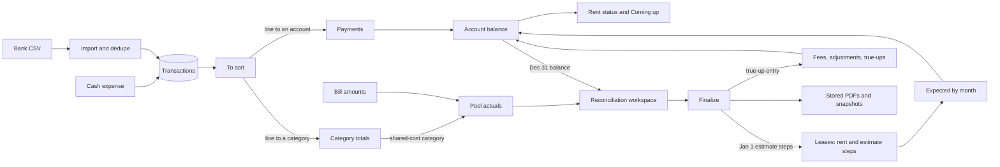

# v1 engineering spec: rent tracking and the 2026 reconciliation

This spec turns `docs/v1/prd.md` into a build plan for the existing monorepo. It covers one owner, one commercial property, and five tenants. The 2026 reconciliation runs in the app in early January 2027. A dry run on January to October 2026 data happens in mid-November 2026.

The PRD was updated to match this spec on 2026-10-04. If they disagree later, fix whichever one is wrong.

## 1. Overview

The owner enters setup once: property, units, pools, categories, tenants, accounts, and leases. After that the work is a loop. Import the bank CSV, sort what came in, check who is behind. At year-end, open the year, fix what the checklist flags, preview the PDFs, and finalize.

An **account** is one tenant in one unit. It is the running tab: it holds the opening balance, payments, fees, adjustments, true-ups, and the balance, and it gets one statement per year. A **lease** belongs to an account and holds the terms: dates, base rent steps, estimate steps, late fee, and insurance date. A renewal is a new lease on the same account.



Nothing posts monthly charges. What a tenant owes is computed on each read from the lease terms, the ledger entries, and the payments.

## 2. Architecture choices

### 2.1 Where code lives

| Area | Package | Postgres schema | Style |
|---|---|---|---|
| Property, units | `packages/contexts/property` | `property` | Existing aggregates, reshaped |
| Tenants | `packages/contexts/tenant-mgmt` | `tenant_mgmt` | Existing aggregate, reshaped |
| Accounts, leases, rent steps, estimate steps | `packages/contexts/lease-mgmt` | `lease_mgmt` | `Account` aggregate that owns its leases (section 4) |
| Pools, categories, bank data, ledger, reconciliation | `packages/contexts/billing` | `billing` | Query-first (2.2) |
| Money and calendar helpers | `packages/shared` | none | Pure functions |
| PDF rendering | new `packages/infrastructure/statement-pdf` (`@moonship/statement-pdf`) | none | One renderer class |
| PG repositories, queries, unit of work | `packages/infrastructure/db` | all | Existing pattern |
| tRPC routers | `packages/api/operator` | none | Existing pattern, all on `propertyProcedure` |
| Pages | `apps/operator-portal` | none | Existing pattern |

The `accounts` table lives in `lease_mgmt` because every lease row points at an account, and keeping both in one schema lets that link be a real foreign key. Billing tables refer to `account_id` by id with no foreign key, the same way `lease_mgmt.leases.unit_id` refers to units today.

Pools live in `billing`. A pool exists only to split a cost, and each shared-cost category points at one pool, so that link is a foreign key inside `billing`. Pool members and estimate steps refer to units and pools by id across schemas.

`billing` depends only on `@moonship/shared`. It defines its own plain input types (2.2) and does not import `lease-mgmt`. The db package maps rows to those types.

### 2.2 Billing is query-first

Billing uses pure functions over plain data, plus one store interface for writes. It has no aggregates and no domain events. Billing is mostly arithmetic over rows the owner edits one at a time, and pure functions are the easiest thing to test against the 2024 numbers. The existing events have no listeners, so they would add files without adding behavior.

Accounts and leases keep the aggregate pattern. They have real rules about dates, steps, and overlapping leases that must hold on every save.

Every billing read loads the whole property's data and computes in memory: about 10 accounts and 300 bank rows a year. No SQL aggregation is needed.

Files in `packages/contexts/billing/src`:

| File | Contents |
|---|---|
| `types.ts` | `AccountTerms`, `LeaseTerms`, `Txn`, `AllocationLine`, `LedgerEntry`, `Pool`, `Category`, `CsvMapping` |
| `lease-calendar.ts` | account start and end, covering lease, counted months, due dates, step lookup (5.1, 5.2) |
| `balance.ts` | expected, balance, history rows (5.3) |
| `rent-status.ts` | Due, Behind, Paid, Credit (5.4) |
| `late-fee.ts` | late-fee suggestions (5.5) |
| `suggestions.ts` | description key, account and category suggestions (5.6) |
| `csv-import.ts` | mapping, row parsing, dedupe plan (5.7) |
| `reconciliation.ts` | pool actuals, statement math, checklist, finalize plan (5.8 to 5.11) |
| `statement-document.ts` | `StatementData` type, letter paragraphs as text runs (section 9) |
| `ports.ts` | `BillingStore`, `BillingQueries`, `StatementRenderer` interfaces |
| `fixtures/2024.ts` | the worked example (section 6) |

```ts
export interface LeaseTerms {
  leaseId: string;
  startDate: IsoDate;
  endDate: IsoDate;
  moveOutDate: IsoDate | null;
  lateFee: { amountCents: number; day: number } | null;
  insuranceExpiresOn: IsoDate | null;
  rentSteps: { id: string; startsOn: IsoDate; amountCents: number; tenantNotifiedAt: Date | null }[];
  estimateSteps: { id: string; poolId: string; startsOn: IsoDate; amountCents: number }[];
}

export interface AccountTerms {
  accountId: string;
  tenantId: string;
  unitId: string;
  openingBalanceCents: number;
  leases: LeaseTerms[];
}
```

`AccountTerms.leases` is ordered by `startDate`.

### 2.3 Database transactions

Repositories and stores take an executor, not a client:

```ts
export type DbTransaction = Parameters<Parameters<DatabaseClient["transaction"]>[0]>[0];
export type DbExecutor = DatabaseClient | DbTransaction;
```

Every `PG*Repository`, `PG*Queries`, and `PGBillingStore` constructor takes a `DbExecutor`. Code that writes child rows (the account save, allocation replace) always calls `this.db.transaction(...)`. On a client that opens a transaction. On a transaction, Drizzle opens a savepoint. So the same class works inside and outside a unit of work.

The API package defines the unit of work it needs:

```ts
export interface TransactionalStores {
  billing: BillingStore;
  accountRepository: AccountRepository;
  unitRepository: UnitRepository;
  propertyRepository: PropertyRepository;
}

export interface UnitOfWork {
  run<T>(fn: (stores: TransactionalStores) => Promise<T>): Promise<T>;
}
```

`@moonship/db` exports `createPGUnitOfWork(db)`. Its `run` calls `db.transaction(tx => fn(storesFor(tx)))`. Stores built inside a transaction get no event dispatcher. The router tests use an in-memory unit of work that copies the fake stores' state before `fn` and restores it if `fn` throws.

These use the unit of work: CSV commit, batch removal, allocation replace, cash expense edit, property register (seeds pools and categories), unit create (joins pools), and finalize.

### 2.4 Dates

- Every calendar date is a `YYYY-MM-DD` string (`IsoDate`). Months are `YYYY-MM` strings (`YearMonth`). String comparison orders both correctly.
- Drizzle `date` columns switch to `{ mode: "string" }`. The column type in Postgres does not change, so this needs no migration.
- tRPC inputs use a shared `isoDate` zod schema (regex plus a real-date check) in `packages/api/operator/src/schemas.ts`. `z.coerce.date()` goes away for calendar dates.
- `created_at`, `updated_at`, `finalized_at`, and `tenant_notified_at` stay as `timestamp`.
- "Today" is the date in the property's time zone. The property gets a `time_zone` column (IANA name). The server computes today with `todayIn(property.timeZone)` and returns it with any response that depends on it, so the browser never uses its own clock for rules.

Helpers in `packages/shared/src/calendar.ts`:

```ts
export type IsoDate = string;
export type YearMonth = string;

export function todayIn(timeZone: string, now?: Date): IsoDate;
export function addDays(date: IsoDate, days: number): IsoDate;
export function monthOf(date: IsoDate): YearMonth;
export function firstDay(month: YearMonth): IsoDate;
export function lastDay(month: YearMonth): IsoDate;
export function addMonths(month: YearMonth, n: number): YearMonth;
export function monthsFromTo(from: YearMonth, to: YearMonth): YearMonth[];
export function dayOfMonth(date: IsoDate): number;
export function dateInMonth(month: YearMonth, day: number): IsoDate;
export function maxDate(a: IsoDate, b: IsoDate): IsoDate;
```

They do arithmetic with `Date.UTC` internally and never expose a `Date`.

The API package has one `today(property)` function that every procedure uses. It returns `todayIn(property.timeZone)`, unless the environment variable `TODAY_OVERRIDE` is set and `VERCEL_ENV` is not `production`. The override lets a preview deployment on a Neon branch act as if it were January (section 11).

### 2.5 Money

- All money is integer cents in `integer` columns and `number` in TypeScript. Money in is positive.
- Shares are never stored or rounded. A pool line is computed from the cents amount, the sqft, and the months in one step with `BigInt`, then rounded once.
- Rounding is half away from zero, which matches `ROUND` in Excel and Google Sheets. `Math.round` is not used for money.

One helper in `packages/shared/src/money.ts` does every proration:

```ts
export function roundDiv(numerator: bigint, denominator: bigint): bigint;

export function prorate(
  amountCents: number,
  multipliers: readonly number[],
  divisors: readonly number[],
): number;
```

`roundDiv` throws when the denominator is not above 0. It rounds the absolute value, then puts the sign back:

```ts
const sign = numerator < 0n ? -1n : 1n;
const abs = numerator * sign;
return sign * ((2n * abs + denominator) / (2n * denominator));
```

The usual one-line form `(2n * n + d) / (2n * d)` is wrong for negative numbers (it gives -1/2 as 0 and -2/3 as 0), because `BigInt` division truncates toward zero.

`prorate` returns `roundDiv(amount × Πmultipliers, Πdivisors)` as a `number`. It throws if a divisor is not above 0 or the result is not a safe integer. Callers check for a zero pool sqft before calling it (5.8). Uses:

| Value | Call |
|---|---|
| Annual share | `prorate(actualCents, [unitSqft, months], [poolSqft, 12])` |
| New monthly estimate | `prorate(actualCents, [unitSqft], [poolSqft, 12])` |
| Rent increase by percent (`bps` = percent × 100, at most 2 decimals) | `prorate(rentCents, [10000 + bps], [10000])` |
| Cost per sqft per year, in cents | `prorate(actualCents, [1], [poolSqft])` |
| Cost per sqft per month, in hundredths of a cent | `prorate(actualCents, [100], [poolSqft, 12])` |
| Share shown as a percent, in hundredths of a percent | `prorate(unitSqft, [10000], [poolSqft])` |

The same file has `parseCents(text: string): number` (accepts `1,234.56`, `$1234.5`, `-12`, `(12.00)`, `12.00-`; parses the string, never through a float) and `formatCents(cents)` (`$1,234.56`, `-$362.79`). The UI replaces `Math.round(Number(v) * 100)` with `parseCents`.

### 2.6 Libraries to add

| Library | Package | Why |
|---|---|---|
| `papaparse` and `@types/papaparse` | `@moonship/api-operator` | Bank CSVs have quoted fields with commas, a BOM, and sometimes preamble lines. A tested parser avoids hand-rolled bugs. |
| `@react-pdf/renderer` | `@moonship/statement-pdf` | Builds PDFs from React components on the server with `renderToBuffer`. No headless Chrome, so it runs in a normal serverless function. |

No date library and no decimal library. The helpers in 2.4 and 2.5 cover what v1 needs.

Add `@moonship/billing` and `@moonship/statement-pdf` to `transpilePackages` in `apps/operator-portal/next.config.js`, next to the other workspace packages.

`BlobStorage.getSignedDownloadUrl(key, expiresInSeconds?)` becomes `getSignedDownloadUrl(key, options?: { expiresInSeconds?: number; fileName?: string })`. When `fileName` is set, `S3BlobStorage` passes `ResponseContentDisposition: attachment; filename="..."` to `GetObjectCommand`, so the download keeps a readable name. `putObject` already takes `{ key, body, contentType }` and needs no change.

## 3. Data model

Conventions for every new table: `id uuid primary key default gen_random_uuid()`, `property_id uuid not null`, `created_at` and `updated_at timestamp not null default now()` unless noted. Every query filters by `property_id`. Foreign keys exist only inside a schema.

### 3.1 `property` schema

**`property.properties`** (changed)

| Column | Type | Notes |
|---|---|---|
| `name`, `address` | unchanged | Building address. Pre-fills unit addresses. |
| `tracking_start_date` | `date null` | Must be the first of a month. Import, rent status, and reconciliation ask the owner to set it when null. Cannot change once any transaction or ledger entry exists. |
| `time_zone` | `varchar(64) not null default 'America/Chicago'` | Editable in Setup. |
| `owner_name`, `owner_title`, `company_name` | `varchar(255) null` | Letter signature. |
| `owner_phone` | `varchar(64) null` | Letter P5. |
| `owner_email` | `varchar(255) null` | Letter P4. |

**`property.units`** (changed)

| Column | Type | Notes |
|---|---|---|
| `label` | `varchar(64) not null` | Unique per property. |
| `sqft` | `integer not null` | Check `sqft > 0`. |
| `sqft_changed_on` | `date null` | Set to today when sqft changes. See "Change dates" below. |
| `address` | `json not null` | `AddressJson`; `street2` holds the suite. |
| `bedrooms`, `bathrooms`, `address_override`, `utilities`, `status` | dropped | |

### 3.2 `tenant_mgmt` schema

**`tenant_mgmt.tenants`** (changed): rename `full_name` to `business_name`. Add `contact_name varchar(255) null` and `mailing_address json null` (`AddressJson`). Keep `email`, `phone`, `notes`, `status`.

### 3.3 `lease_mgmt` schema

**`lease_mgmt.accounts`** (new)

| Column | Type | Notes |
|---|---|---|
| `tenant_id` | `uuid not null` | |
| `unit_id` | `uuid not null` | Index `(property_id, unit_id)`. |
| `opening_balance_cents` | `integer not null default 0` | What the tenant owed at the end of the day before tracking start, including last year's true-up. Prepayments are negative. Must be 0 when the account starts after tracking start; use a dated adjustment instead. |

An account has no status column. It is closed when its newest lease has a move-out date (5.1).

**`lease_mgmt.leases`** (dropped and created again)

| Column | Type | Notes |
|---|---|---|
| `account_id` | `uuid not null references accounts on delete cascade` | Index. |
| `start_date`, `end_date` | `date not null` | |
| `move_out_date` | `date null` | |
| `late_fee_cents` | `integer null` | Check `> 0`. |
| `late_fee_day` | `smallint null` | Check `between 1 and 28`. Check both late-fee columns are null or both are set. |
| `insurance_expires_on` | `date null` | |

The old `unit_id`, `tenant_id`, `rent_cents`, `deposit_cents`, `status`, and `document_*` columns are gone. Unit and tenant are on the account.

**`lease_mgmt.lease_rent_steps`** (new): `id`, `lease_id uuid not null references leases on delete cascade`, `starts_on date not null`, `amount_cents integer not null check >= 0`, `tenant_notified_at timestamp null`. Unique `(lease_id, starts_on)`.

**`lease_mgmt.lease_estimate_steps`** (new): `id`, `lease_id` (cascade), `pool_id uuid not null`, `starts_on date not null`, `amount_cents integer not null check >= 0`. Unique `(lease_id, pool_id, starts_on)`. A lease pays a pool from its first step for that pool (5.2).

Lease and step tables have no `property_id`; they are always read through their account.

### 3.4 `billing` schema: setup

**`billing.cost_pools`**: `name varchar(64) not null`, `letter_name varchar(64) not null` (the word used in letter P3, such as "tax"), `adds_new_units boolean not null default false`, `sort_order integer not null default 0`, `members_changed_on date null`. Unique `(property_id, name)`.

**`billing.cost_pool_units`**: `pool_id uuid references cost_pools on delete cascade`, `unit_id uuid not null`, `property_id uuid not null`. Primary key `(pool_id, unit_id)`.

Change dates. Pool members and unit sqft have no history; the current values apply to the whole year being reconciled, as the PRD does for area. `cost_pools.members_changed_on` is set to today when a unit joins or leaves the pool, and `units.sqft_changed_on` when sqft changes. Changes made before the property's first transaction exists do not set them, so initial setup does not cause a warning. The checklist warns when either date falls in the year being reconciled (5.10).

**`billing.categories`**

| Column | Type | Notes |
|---|---|---|
| `name` | `varchar(64) not null` | Unique per property. For a shared-cost category it always equals the pool's name. |
| `kind` | `varchar(32) not null` | Check in `shared_cost`, `owner_expense`, `income`, `not_counted`. No procedure changes it. |
| `pool_id` | `uuid null unique references cost_pools on delete restrict` | Check `(kind = 'shared_cost') = (pool_id is not null)`. |
| `archived_at` | `timestamp null` | Archived categories are hidden from pickers and suggestions and still count in totals. Shared-cost categories cannot be archived; remove the pool instead. |

Seeded on property register, and for existing properties by migration:

| Pool | `letter_name` | `adds_new_units` | Category |
|---|---|---|---|
| CAM | CAM | true | CAM (shared cost) |
| Taxes | tax | true | Taxes (shared cost) |
| Insurance | insurance | true | Insurance (shared cost) |
| Water | water | false | Water (shared cost) |

Other seeded categories: Repairs and Owner utilities (owner expense), Other income (income), Security deposit and Not property business (not counted).

### 3.5 `billing` schema: bank data

**`billing.bank_accounts`**: `name varchar(64) not null default 'Business checking'`, `csv_mapping jsonb null`. Unique `(property_id)`; one bank account per property in v1. Created on first import.

```ts
export interface CsvMapping {
  dateColumn: string;
  dateFormat: "MM/DD/YYYY" | "YYYY-MM-DD" | "DD/MM/YYYY";
  descriptionColumn: string;
  amount:
    | { mode: "signed"; column: string; flipSign: boolean }
    | { mode: "debitCredit"; debitColumn: string; creditColumn: string };
  idColumn: string | null;
}
```

**`billing.import_batches`**: `bank_account_id uuid not null references bank_accounts`, `file_name text not null`, `imported_at timestamp not null default now()`, `row_count`, `inserted_count`, `duplicate_count`, `before_tracking_start_count`, `not_transaction_count` (all `integer not null`), `first_posted_on date null`, `last_posted_on date null`. No `updated_at`.

**`billing.transactions`** holds bank rows and cash expenses.

| Column | Type | Notes |
|---|---|---|
| `source` | `varchar(8) not null` | Check in `bank`, `cash`. |
| `bank_account_id` | `uuid null references bank_accounts` | Set for `bank`. |
| `import_batch_id` | `uuid null references import_batches` | Set for `bank`. |
| `posted_on` | `date not null` | Bank posting date, or the cash expense date. |
| `description` | `text not null` | Trimmed raw text. |
| `description_key` | `text not null` | See 5.6. |
| `amount_cents` | `integer not null` | Check `<> 0`. Positive is money in. |
| `external_id` | `text null` | Bank transaction id when the CSV has one. |
| `raw_row_hash` | `text null` | SHA-256 of the row's cells joined with `\u001f`. Kept for tracing, not unique. |

Checks: `source = 'bank'` requires `bank_account_id`, `import_batch_id`, and `raw_row_hash`. `source = 'cash'` requires those to be null and `amount_cents < 0`.

Indexes: unique `(bank_account_id, external_id) where external_id is not null`; `(bank_account_id, posted_on, description_key, amount_cents)` for dedupe; `(property_id, posted_on)`.

Bank rows are deleted only by removing a whole batch that has no sorted rows (5.7). Cash rows can be edited and deleted.

**`billing.transaction_allocations`**: `transaction_id uuid not null references transactions on delete cascade`, `account_id uuid null`, `category_id uuid null references categories on delete restrict`, `amount_cents integer not null check <> 0`. Check `num_nonnulls(account_id, category_id) = 1`. Indexes on `transaction_id`, `account_id`, `category_id`. No `updated_at`; lines are replaced, not edited.

A transaction is sorted when it has lines. To replace lines, the store opens a database transaction, locks the transaction row with `select ... for update`, deletes the old lines, inserts the new ones, and rejects the write unless they add up to `amount_cents`. The lock makes a double-submitted Confirm end with one set of lines, not two. Editing a cash expense updates the row and replaces its single line in the same database transaction. A line to an account is a payment and may be negative (refund, bounced check). A line to a category may have either sign. One check that covers two of a tenant's units is split into one line per account.

### 3.6 `billing` schema: account ledger

**`billing.account_ledger_entries`**

| Column | Type | Notes |
|---|---|---|
| `account_id` | `uuid not null` | |
| `kind` | `varchar(24) not null` | `late_fee`, `late_fee_dismissed`, `adjustment`, `true_up` |
| `entry_date` | `date not null` | |
| `amount_cents` | `integer not null` | Positive adds to what the tenant owes. |
| `note` | `text null` | |
| `fee_month` | `char(7) null` | `YYYY-MM`, late-fee kinds only. |
| `reconciliation_year_id` | `uuid null references reconciliation_years` | `true_up` only. |

Checks by kind:

| Kind | Rule |
|---|---|
| `late_fee` | `amount_cents > 0`, `fee_month` set |
| `late_fee_dismissed` | `amount_cents = 0`, `fee_month` set |
| `adjustment` | `amount_cents <> 0`, `note` not empty |
| `true_up` | `reconciliation_year_id` set, `amount_cents <> 0` |

Unique `(account_id, fee_month) where fee_month is not null`. Unique `(reconciliation_year_id, account_id) where kind = 'true_up'`.

The opening balance is not a ledger row. It stays on the account (3.3).

Once a year is finalized, a new late fee or adjustment whose date would fall inside that year is dated on the day the owner saves it instead, and the response says so. A finalized statement then stays true to what was sent.

### 3.7 `billing` schema: reconciliation

**`billing.reconciliation_years`**: `year integer not null`, `status varchar(16) not null default 'draft'` (check in `draft`, `finalized`), `letter_date date null`, `finalized_at timestamp null`. Unique `(property_id, year)`. Check `status <> 'finalized' or (finalized_at is not null and letter_date is not null)`. The row is created by the first write for that year (letter date or bill amount) or by finalize.

**`billing.pool_bill_overrides`**: `reconciliation_year_id uuid not null references reconciliation_years on delete cascade`, `pool_id uuid not null references cost_pools`, `amount_cents integer not null check >= 0`, `note text not null` (check not empty). Unique `(reconciliation_year_id, pool_id)`.

**`billing.reconciliation_statements`** (finalized snapshots): `reconciliation_year_id` (references), `account_id uuid not null`, `tenant_id uuid not null`, `data jsonb not null` (`StatementData`, section 9), `true_up_cents integer not null`, `balance_on_account_cents integer not null`, `pdf_storage_key text not null`, `created_at`. Unique `(reconciliation_year_id, account_id)`. No `updated_at`; rows are never changed.

### 3.8 Existing rows and code

| Today | What happens |
|---|---|
| Utility share graph (`UtilityAssignment`, `validateUtilityAssignments`, unit dialog utilities UI, `utilities` column) | Removed. Pools replace it. |
| Unit `status`, `changeStatus`, `UnitStatusChanged`, bedrooms, bathrooms | Removed. Vacancy comes from account dates. |
| Unit `address_override` | Replaced by a full `address`. Migration fills it with the override, or the property address when there is none. |
| Unit rows with `sqft <= 0` or a label used twice on one property | Migration deletes units with `sqft <= 0` (no lease points at them after the lease tables are dropped) and adds " 2", " 3" to later duplicate labels by `created_at`, before adding the checks. |
| `unit.remove` checks for an active lease | Checks for any account on the unit. Also deletes the unit's pool member rows. |
| `Lease` aggregate and `LeaseRepository` | Replaced by the `Account` aggregate and `AccountRepository` (section 4). |
| Existing lease rows | Dropped with the old table. The owner enters every account and lease in M1. An earlier migration already cleared tenants and leases, so little or nothing is lost. |
| Lease document upload (`attachDocument`, `documentDownloadUrl`, `LeaseDocument`, `LeaseDocumentAttached`, `document_*` columns) | Removed. Objects under the `leases/` key prefix stay in the bucket; nothing reads them. `BlobStorage` stays for PDFs. |
| Lease status lifecycle (`draft`, `active`, `ended`, `activate`, `end`, `LeaseActivated`, `LeaseEnded`, `status` filter) | Removed. State comes from dates (5.1). |
| One active lease per unit check (`listActiveByUnitId`) | Replaced by the account overlap rule in section 4. |
| `deposit_cents` | Gone with the old table. Security deposits are bank deposits sorted to the Security deposit category. |
| Tenant `full_name` | Renamed to `business_name`. |
| `/property` page | Becomes `/setup`. The path is also hard-coded in `app/page.tsx`, `(authenticated)/access/page.tsx`, `(authenticated)/_lib/require-operator-context.ts`, and `_components/sidebar-nav.tsx`; change all four. |
| `/events` stub page and its components | Deleted. |
| Sidebar template items | Replaced (8.2). |

`docs/operator-access.md` lists the operate screens as `/property`, `/tenants`, `/leases`, `/events`. Update that line when this ships.

### 3.9 Migration order

`pnpm db:migrate` generates and applies in one step. For these migrations, run `db:migrate:generate`, review the SQL, add the data steps by hand, then run `db:migrate:execute`. drizzle-kit asks whether `full_name` to `business_name` is a rename; answer yes, or write that statement by hand.

| # | Milestone | Migration |
|---|---|---|
| 1 | M1 | `property`: add property columns; add `units.address`, fill it from `address_override` or the property address, set not null; add `sqft_changed_on`; clean up unit rows (3.8); add the sqft and label checks; drop unit columns. |
| 2 | M1 | `billing`: `cost_pools`, `cost_pool_units`, `categories`. Seed defaults for every existing property, with all its current units in CAM, Taxes, and Insurance. |
| 3 | M1 | `tenant_mgmt`: rename column, add two columns. |
| 4 | M1 | `lease_mgmt`: drop `leases`; create `accounts`, `leases`, `lease_rent_steps`, `lease_estimate_steps`. |
| 5 | M2 | `billing`: `bank_accounts`, `import_batches`, `transactions`, `transaction_allocations`. |
| 6 | M3 | `billing`: `account_ledger_entries` (without the year foreign key). |
| 7 | M4 | `billing`: `reconciliation_years`, `pool_bill_overrides`; add the foreign key from `account_ledger_entries.reconciliation_year_id`. |
| 8 | M5 | `billing`: `reconciliation_statements`. |

## 4. Account aggregate

`Account` in `lease-mgmt` is the aggregate. It owns its leases, and each lease owns its rent and estimate steps. `PGAccountRepository.save` upserts the account row, upserts its leases, deletes leases that were removed, and deletes and reinserts every lease's steps, all inside `this.db.transaction`. It keeps step ids and `tenant_notified_at`. Nothing outside the aggregate refers to a lease id, so leases can be rewritten freely. Events: `AccountOpened`, `LeaseAdded`, `LeaseUpdated`, `LeaseRemoved`.

Methods: `open(props, firstLease)` (static), `setOpeningBalance(cents)`, `addLease(terms)`, `updateLease(leaseId, terms)` (dates, move-out, late fee, insurance date, both step lists), `removeLease(leaseId)`, `setEstimateStep(leaseId, poolId, startsOn, amountCents)` (used by finalize; replaces a step on the same date), `markRentStepNotified(leaseId, stepId, at | null)`.

Rules the aggregate checks:

1. Each lease: `endDate >= startDate`; `moveOutDate` is null or `>= startDate`.
2. Rent steps: at least one; the first starts on the lease's `startDate`; dates are distinct; amounts `>= 0`. Changing a lease's start date moves the first rent step with it.
3. Estimate steps, per pool: dates are distinct and on or after the lease's `startDate`; amounts `>= 0`. The first step does not have to be on the start date, so a lease can start paying a pool partway through. Steps after the end date are allowed (holdover and finalize add them).
4. Late fee: amount `> 0` and day 1 to 28, or neither.
5. An account has at least one lease. Leases on one account do not overlap (`[startDate, endDate]`).
6. Only the newest lease may have a move-out date. A lease cannot be added after a lease with a move-out date. A tenant who comes back gets a new account.

Rules the router checks, because they span aggregates or contexts:

7. The account's unit and tenant belong to the property; the tenant is active when the account opens. The opening balance is 0 when the account starts after the tracking start date.
8. Accounts on the same unit do not overlap. Each account covers `[accountStart, accountEnd ?? forever]` (5.1). An account in holdover blocks a new account on that unit until the owner enters a move-out date.
9. Every pool a lease pays contains the account's unit.
10. An account can be deleted only when it has no allocation lines, ledger entries, or statement snapshots. A lease can be removed when the account has another lease.

A tenant renting two units has two accounts. A tenant moving to another unit gets a new account: the owner enters a move-out date on the old account's lease and moves any remaining balance with two adjustments (a credit on the old account, a charge of the same amount on the new one). There is no special feature for this.

## 5. Domain rules

### 5.1 Accounts, leases, and holdover

```text
accountStart(A) = the earliest lease startDate
newest(A)       = the lease with the latest startDate
accountEnd(A)   = newest(A).moveOutDate (null while there is none)

openOn(A, d)    = accountStart(A) <= d and (accountEnd(A) is null or d <= accountEnd(A))
holdover(A, today) = accountEnd(A) is null and today > newest(A).endDate

coveringLease(A, d) = the lease of A with the latest startDate <= d

accountState(A, today) =
  upcoming   if today < accountStart(A)
  closed     if accountEnd(A) < today
  holdover   if holdover(A, today)
  open       otherwise
```

The covering lease on a date is the newest lease that has started by then. That rule gives holdover with no extra code. After the newest lease's end date, with no move-out date, it stays the covering lease, and step lookup (5.2) keeps returning its last rent and estimates. The same happens in a gap between two leases. The home page lists holdover accounts as "Past end date". The owner adds a lease or enters a move-out date to stop it.

### 5.2 Counted months, due dates, and steps

`T` is the property's tracking start date (always a first of month).

```text
counted(A, m) =
  firstDay(m) >= T
  and accountStart(A) <= lastDay(m)
  and (accountEnd(A) is null or accountEnd(A) >= firstDay(m))

due(A, m)   = maxDate(firstDay(m), accountStart(A))
lease(A, m) = coveringLease(A, due(A, m))

stepOn(steps, d)    = the step with the latest startsOn <= d
rentOn(L, d)        = stepOn(L.rentSteps, d).amountCents
paysOn(L, P, d)     = L has an estimate step for pool P with startsOn <= d
estimateOn(L, P, d) = stepOn(L.estimateSteps for P, d).amountCents     only when paysOn(L, P, d)

monthlyExpected(A, m) =
  L = lease(A, m), d = due(A, m)
  rentOn(L, d) + Σ over pools P with paysOn(L, P, d): estimateOn(L, P, d)
```

Months are counted per account, so a month is never counted twice. A counted month expects the full amount, with no proration.

Rent and estimates for a month are the ones in effect on the later of the 1st and the account start. So a lease that starts in the middle of a month takes over from the next month: if the old lease ends June 14 and the new one starts June 15, June is billed at the old lease's terms because June is due June 1.

A pool counts for a month only when the covering lease has a step for it dated on or before the due date. A tenant whose first Water step is 2024-07-01 pays Water from July, and the statement counts 6 Water months.

### 5.3 Expected and balance

`payments(A, from, to)` is the sum of allocation lines to account `A` whose transaction `posted_on` is in `[from, to]`. `entries(A, to)` is the sum of `A`'s ledger entries with `entry_date <= to`.

```text
expected(A, asOf) =
  A.openingBalanceCents
  + Σ over months m with counted(A, m) and due(A, m) <= asOf: monthlyExpected(A, m)
  + entries(A, asOf)

received(A, asOf) = payments(A, T, asOf)

balance(A, asOf) = expected(A, asOf) - received(A, asOf)
```

Positive means the tenant owes money. This is the identity in AC 5: opening balance plus monthly expected amounts, fees, adjustments, and true-ups, minus payments.

The history for an account lists, oldest first, with a running balance:

- Opening balance, dated the day before `T`. Only accounts that start on or before `T` can have one (section 4, rule 7).
- One row per counted month, dated `due(A, m)`, with base rent and each estimate shown.
- One row per payment line, dated `posted_on`, with the bank description.
- One row per ledger entry. Dismissed late fees show as a note with no amount.

Rows run through today.

### 5.4 Rent status

```text
status(A, today):
  B = balance(A, today)
  if B < 0: return Credit
  if B = 0: return Paid
  m = monthOf(today)
  if counted(A, m):
    graceDate = maxDate(dateInMonth(m, lease(A, m).lateFee?.day ?? 5), due(A, m))
  else:
    graceDate = dateInMonth(m, 5)
  thisMonth = (counted(A, m) and due(A, m) <= today ? monthlyExpected(A, m) : 0)
            + Σ positive ledger entries on A dated in m and <= today
  if today <= graceDate and B <= thisMonth: return Due
  return Behind
```

`Due` means only this month's charges are unpaid and the grace date has not passed. The grace date is never before the month's due date, so a tenant who moves in on February 15 is Due, not Behind, on move-in day. Anything left over from an earlier month makes the account `Behind` right away, whatever the day. The rent status table lists accounts open today, plus closed accounts with a non-zero balance. It sorts Behind first, then Due, then the rest, and by balance from largest within each group.

Each row shows tenant, unit, expected so far, received so far, balance, last payment date, and status, all from 5.3 with `asOf = today`.

### 5.5 Late-fee suggestions

```text
lateFeeMonths(today) = [monthOf(today)]

lateFeeSuggestion(A, m, today):
  if not counted(A, m): none
  L = lease(A, m)
  if not L.lateFee: none
  feeDate = maxDate(dateInMonth(m, L.lateFee.day), due(A, m))
  if today <= feeDate: none
  if a late_fee or late_fee_dismissed entry exists for (A, m): none
  carriedCredit = max(0, -balance(A, addDays(due(A, m), -1)))
  paid = payments(A, due(A, m), feeDate) + carriedCredit
  if paid >= monthlyExpected(A, m): none
  if balance(A, today) <= 0: none
  suggest { accountId: A.accountId, month: m, amountCents: L.lateFee.amountCents }
```

Suggestions are checked for the current month only. Once the month ends, its suggestion is gone; the owner adds a missed fee by hand as an adjustment.

Old balances and true-ups never cause a suggestion, because only payments against that month's expected amount are tested. A credit carried into the month counts as paid. August 1, 2026 is a Saturday, so an autopay posts Friday, July 31; the balance on July 31 is a credit of the full August amount, and no fee is suggested for August even if some other charge is still open.

The test looks only at payments up to the fee date. A check that posts on the 3rd and bounces on the 15th counts as paid, so no fee is suggested. The owner adds that fee as an adjustment.

Approve writes a `late_fee` entry with the lease's fee amount, dated `feeDate + 1 day`, or the day of approval when that date falls in a finalized year (3.6). Dismiss writes a `late_fee_dismissed` entry. The server recomputes the suggestion before writing and rejects the call if there is none. The owner can delete either entry, which brings the suggestion back while the month lasts. Nothing else writes these entries.

Example. Base rent plus estimates is $3,654.82. The fee is $50.00 after the 10th. Payments dated March 1 to 10 add up to $3,000.00, and the balance on March 15 is $654.82. The app suggests a $50.00 fee for 2026-03 until March 31. If the owner approves, the entry is dated March 11 and the balance becomes $704.82.

### 5.6 Sorting suggestions

```text
descriptionKey(text) =
  lowercase(text), replace every run of characters outside a-z with one space, trim
```

`"ACH DEP 0412 SUPER-LUCKY LLC"` becomes `"ach dep super lucky llc"`. The key is stored on each transaction at import.

Suggestions are computed when the To sort list loads. They are never stored and never applied without the owner pressing Confirm.

```text
categorySuggestion(t) =
  the category of the most recent sorted transaction with the same key
  whose lines are a single category line, skipping archived categories

accountSuggestion(t), only when t.amount > 0:
  accounts = distinct accounts of earlier single-line account matches with the same key
  if accounts has exactly one: suggest it
  else:
    m = monthOf(t.postedOn)
    matches = accounts A with counted(A, m) and monthlyExpected(A, m) = t.amount
    if matches has exactly one: suggest it
    if more than one: list them as choices with none picked
```

For money in, the account suggestion shows first; the category suggestion shows when there is no account suggestion. A tenant with two units pays from one bank description, so the key matches two accounts and the rule falls back to the amount. A single check covering both units matches neither amount, and the owner splits it.

### 5.7 CSV import and dedupe

Parsing:

1. Parse with papaparse, no header mode. Rows above the header row are ignored.
2. Finding the header row. With a saved mapping, it is the first row that contains every mapped column name. On the first preview, before any mapping exists, it is the first row with at least three non-empty cells. The preview shows which row it picked, and the owner can enter a different row number; `preview` and `commit` take it as an optional `headerRow` input. The owner then picks the mapped columns from that row's cells.
3. Dates: the three formats accept one- or two-digit months and days (`1/5/2026` and `01/05/2026` are both January 5 in `MM/DD/YYYY`). Years have four digits. The date must exist (no February 30).
4. Amount: `signed` mode uses `parseCents(column)`, negated when `flipSign`. `debitCredit` mode uses `parseCents(credit) - parseCents(debit)` on absolute values, with blank as 0.
5. Row outcomes:

| Date | Amount | Outcome |
|---|---|---|
| blank row | | skipped, not counted |
| parses | parses | a transaction |
| parses | does not parse | error |
| does not parse | parses | error |
| does not parse | blank or does not parse | "not a transaction row", counted and listed in the preview |

The preview lists each error with its row number and cells. The owner either fixes the mapping or ticks "Skip" on the row. `commit` takes the skipped row numbers and rejects the import if any error row is not in that list. So a "Total" footer line with an amount is skipped with one click, and nothing with an amount is ever left out without the owner seeing it.

6. Skip zero amounts. Skip rows dated before the tracking start date and count them.

Dedupe, per row in file order. Stored state per key `(postedOn, descriptionKey, amountCents)`: the total count of stored rows, the count of stored rows with no `external_id`, and the key of every stored `external_id`.

```text
key = (postedOn, descriptionKey, amountCents)
if mapping.idColumn and row has an id:
  if the id is stored or appeared earlier in this file:
    duplicate when its stored or earlier key equals key, otherwise an error row
  else:
    if storedNoId[key] > usedNoId[key]: usedNoId[key] += 1 and it is a duplicate
    else insert
else:
  seenInFile[key] += 1
  insert if seenInFile[key] > storedTotal[key] - usedNoId[key]
```

This keeps `max(count already stored, count in this file)` rows per key. Two real $25.00 fees on the same day both import. Importing the same file again inserts nothing. An overlapping file inserts only the rows past what is stored.

Commit runs in one unit of work: lock the `bank_accounts` row with `select ... for update`, read stored counts and external ids for the file's date range, insert the batch and the rows, and save the mapping. The preview runs the same plan without writing.

Single bank rows are never deleted. Deleting one would lower the stored count, and the next overlapping import would add it back. If a duplicate gets in (for example the bank changed a description between exports), the owner sorts it to a not-counted category.

A whole batch can be removed when none of its rows has allocation lines. This undoes an import made with a wrong mapping, such as a flipped sign. `removeBatch` locks the `bank_accounts` row, checks that no row in the batch is sorted, and deletes the rows and the batch in one unit of work.

Changing `idColumn` between imports is safe: an id row first uses up a stored row with the same key and no id, and a row with no id is compared with every stored row with that key. The mapping form still warns when it changes. A known id whose date, description, or amount changed is an error row the owner skips.

### 5.8 Pool actual cost

```text
actual(P, Y) =
  override(P, Y).amountCents  if a bill amount is entered
  else -(Σ allocation lines to P's category whose transaction posted_on is in year Y)

poolSqft(P) = Σ sqft of units in P, whether or not an account covers them
```

The minus sign turns money out into a positive cost. A deposit sorted to the category, such as an insurance refund, lowers the cost. If refunds are larger than costs, the actual is negative and the checklist blocks finalize (5.10); the owner enters a bill amount. The pool card shows the bill amount next to the category total when both exist.

Pool members and unit sqft are the current values, used for the whole year (3.4).

When `poolSqft(P)` is 0, nothing calls `prorate` for that pool. The pool card shows "No units" in place of cost per sqft, statement rows for it show "Pool has no units" with no amounts, and the checklist blocks finalize. The seeded Water pool starts this way.

### 5.9 Year-end statement

For year `Y` and account `A`, using 5.2:

```text
months    = { m in Y : counted(A, m) }
paysIn(m, P) = paysOn(lease(A, m), P, due(A, m))
paidPools = pools P where paysIn(m, P) for some m in months
J         = coveringLease(A, Y+1-01-01) if openOn(A, Y+1-01-01), else none
jan1      = Y+1-01-01

for each P in paidPools, in pool sort order:
  monthsP   = |{ m in months : paysIn(m, P) }|
  part      = prorate(actual(P, Y), [unit.sqft, monthsP], [poolSqft(P), 12])
  estimates = Σ over m in months with paysIn(m, P): estimateOn(lease(A, m), P, due(A, m))
  balanceP  = part - estimates

trueUp           = Σ balanceP
priorAsOf        = min(Y-12-31, today)
priorBalance     = balance(A, priorAsOf)
balanceOnAccount = trueUp + priorBalance

if J:
  newEstimate[P] = prorate(actual(P, Y), [unit.sqft], [poolSqft(P), 12])  for each P with paysOn(J, P, jan1)
  newMonthlyRent = rentOn(J, jan1) + Σ newEstimate[P]
  insuranceRequest = J.insuranceExpiresOn is null or J.insuranceExpiresOn < jan1
```

Pools with `poolSqft(P) = 0` skip both `prorate` calls (5.8).

- An account gets a statement when `paidPools` is not empty. That includes tenants who moved out during the year. A tenant with two accounts gets two statements.
- An account with two leases in the year (a renewal) counts each month once and adds up the estimates expected under each lease.
- "Estimates" are what the account was expected to pay, not cash received. Short payments stay in `priorBalance`.
- The true-up for year `Y` is dated in `Y+1` (5.11), so `balance(A, Y-12-31)` never includes it, and January of `Y+1` is not counted.
- During the November dry run, `priorAsOf` is today. The workspace labels it "Rent balance as of {date}".
- A pool with zero actual cost still gets a row: part 0, balance equal to minus the estimates, new estimate 0.
- `newEstimate` uses a full year's share even when `monthsP < 12`.

### 5.10 Checklist

Blockers (finalize stays disabled):

1. No transaction dated in `Y` is left to sort.
2. Every pool on a statement has a total sqft above 0 and contains the account's unit.
3. No pool on a statement has a negative actual cost (5.8).
4. Owner name, title, company, phone, and email are set, and every statement tenant has a mailing address.

Warnings (shown, not blocking):

5. A pool had a bill amount in `Y-1` and has none in `Y`.
6. An account is in holdover. Finalize would give it new estimates.
7. "Bank data only through {date}" when the newest imported `posted_on` is before `Y-12-31`.
8. A pool's members or a unit's sqft changed during `Y` (`members_changed_on` or `sqft_changed_on` on or after `Y-01-01`). The current values apply to the whole year.

Finalize also needs: status `draft`, a letter date after `Y-12-31`, and today after `Y-12-31`.

### 5.11 Finalize

Finalize is one request that does everything inside one unit of work:

```text
finalize(Y):
  unitOfWork.run(stores):
    yr = stores.billing.lockYear(propertyId, Y)       select ... for update, insert if missing
    if yr.status = finalized: throw CONFLICT
    ws = workspace(Y) read through stores
    check 5.10 blockers and gates
    for s in ws.statements:
      key = reconciliations/{propertyId}/{Y}/{s.accountId}.pdf
      blobStorage.putObject({ key, body: renderer.render(s.data), contentType: "application/pdf" })
      insert reconciliation_statements row with s and key
      if s.trueUp <> 0: insert true_up entry on s.accountId, entry_date = letterDate, amount = s.trueUp
      if s.J:
        account = stores.accountRepository.findById(propertyId, s.accountId)
        for each P with paysOn(J, P, jan1): account.setEstimateStep(J.leaseId, P, jan1, newEstimate[P])
        stores.accountRepository.save(account)
    set yr.status = finalized, finalized_at = now, letter_date
```

- The row lock and the status check stop a second finalize; the unique `(reconciliation_year_id, account_id)` on snapshots backs them up. Holding the transaction open for a few seconds while five PDFs render and upload is fine for one owner.
- Only accounts with a statement get new estimates, on the lease that covers January 1 of `Y+1`. A lease starting on January 1 of `Y+1` is that lease. A lease starting later keeps its typed estimates. An account that opens after January 1 of `Y+1` has no statement for `Y`, so it keeps its typed estimates.
- `setEstimateStep` replaces a step dated January 1 of `Y+1` if the owner typed one. Later steps stay.
- If anything fails, the transaction rolls back and nothing in the database changes. PDFs already uploaded stay in the bucket under the same keys, and the next attempt overwrites them.
- Finalize runs once per year. A later mistake is fixed with an adjustment.

After finalize, the year page shows the stored snapshots. It recomputes each statement and compares the pool lines, true-up, rent balance, balance on account, new estimates, and new rent with the snapshot. When any differ, the account shows "Current data no longer matches this statement" with each changed value as snapshot, now, and difference, such as "Balance on account: $651.48, now $701.48 (+$50.00)". The finalize writes themselves do not cause a mismatch: the true-up is dated after December 31, and new estimates start January 1 of `Y+1`. New fees and adjustments cannot be dated inside the finalized year (3.6), so a mismatch comes from bank rows, sorting, or lease edits.

The finalized page also lists January `Y+1` for each continuing account: new monthly rent, payments dated in January so far, and the difference. This answers which tenants' January 1 payment came in at the old amount.

### 5.12 Coming up

All windows are inclusive and use the property's today. "Next N days" means `today <= date <= addDays(today, N)`.

| List | Rule |
|---|---|
| Behind | Rent status rows with status Behind, with their late-fee suggestions and Approve and Dismiss buttons. |
| To sort | Count of transactions with no lines. |
| Rent changes | Rent steps with `startsOn` in the next 90 days, except the first step of an account's first lease. Each has a "Tenant notified" toggle that sets `tenant_notified_at`. |
| Insurance | For each account open today or opening in the next 60 days, the lease covering today (or the first lease if not yet open): `insurance_expires_on` is null, already past, or within the next 60 days. |
| Leases ending | Accounts with no move-out date whose newest lease has `end_date` in the next 90 days. |
| Past end date | Accounts in holdover. |

## 6. Worked example (test fixture)

`packages/contexts/billing/src/fixtures/2024.ts` holds this data. `reconciliation.test.ts` and `balance.test.ts` assert every value below.

Property: tracking start 2024-01-01. Letter date 2025-01-01. Reconcile 2024 with `today = 2025-01-08`.

| Unit | Sqft | Pools |
|---|---|---|
| A | 2,500 | CAM, Taxes, Insurance |
| B | 2,000 | CAM, Taxes, Insurance, Water |
| C | 2,350 | CAM, Taxes, Insurance, Water |
| D | 1,250 | CAM, Taxes, Insurance |
| E | 1,250 | CAM, Taxes, Insurance |

Building and CAM, Taxes, Insurance pools: 9,350 sqft. Water pool: 4,350 sqft. Units B to E are made up so the sqft totals match the owner's 2024 spreadsheet. Units C and E have no account.

| Pool | 2024 actual | Cost per sqft per year | Cost per sqft per month |
|---|---|---|---|
| CAM | 12,891.19 | $1.38 | $0.1149 |
| Taxes | 33,542.31 | $3.59 | $0.2990 |
| Insurance | 6,284.00 | $0.67 | $0.0560 |
| Water | 1,879.17 | $0.43 | $0.0360 |

### 6.1 Super Lucky, full year (from the owner's 2024 spreadsheet)

Account on unit A, opening balance 0. One lease, 2023-01-01 to 2027-12-31. Base rent 2,500.00. Estimates CAM 268.61, Taxes 777.61, Insurance 108.60. Insurance expires 2024-11-30.

Monthly expected: 3,654.82. Payments: 3,654.82 on the 1st of January to November, 3,241.08 on 2024-12-01.

| Check | Expected value |
|---|---|
| `expected(A, 2024-12-31)` | 43,857.84 |
| `received(A, 2024-12-31)` | 43,444.10 |
| `balance(A, 2024-12-31)` | 413.74 |

| Pool | Months | Share shown | Annual share | Estimates billed | Balance due |
|---|---|---|---|---|---|
| CAM | 12 | 26.74% | 3,446.84 | 3,223.32 | 223.52 |
| Taxes | 12 | 26.74% | 8,968.53 | 9,331.32 | -362.79 |
| Insurance | 12 | 26.74% | 1,680.21 | 1,303.20 | 377.01 |

| Line | Expected value |
|---|---|
| True-up | 237.74 |
| Rent balance | 413.74 |
| Balance on account | 651.48 |
| New estimates from 2025-01-01 | CAM 287.24, Taxes 747.38, Insurance 140.02 |
| New monthly rent | 2,500.00 + 287.24 + 747.38 + 140.02 = 3,674.64 |
| Insurance paragraph | included |
| Finalize writes | `true_up` +237.74 on the account dated 2025-01-01; three estimate steps on the lease dated 2025-01-01 |

The spreadsheet shows 237.75, 651.49, and 3,674.63 because it adds unrounded amounts. The test asserts the app's values above.

If January 2025 is then paid at the old 3,654.82, the January table shows the account short by 19.82.

### 6.2 Tenant D, moved out in August (AC 9)

Account on unit D, opening balance 0. One lease, 2022-09-01 to 2025-08-31, move-out 2024-08-15. Base rent 1,600.00. Estimates CAM 130.00, Taxes 375.00, Insurance 55.00. Monthly expected 2,160.00, paid in full each month. Counted months: January to August, so 8.

| Pool | Months | Share shown | Annual share | Estimates billed | Balance due |
|---|---|---|---|---|---|
| CAM | 8 | 13.37% | 1,148.95 | 1,040.00 | 108.95 |
| Taxes | 8 | 13.37% | 2,989.51 | 3,000.00 | -10.49 |
| Insurance | 8 | 13.37% | 560.07 | 440.00 | 120.07 |

| Line | Expected value |
|---|---|
| `expected(A, 2024-12-31)` | 17,280.00 |
| True-up | 218.53 |
| Rent balance | 0.00 |
| Balance on account | 218.53 |
| `J` | none: no new estimates, no revised rent block, no P3, no P4 |
| Finalize writes | `true_up` +218.53 on the account dated 2025-01-01 |

### 6.3 Tenant B, a renewal on one account, with a credit

Account on unit B, opening balance 250.00.

Lease B1, 2021-06-01 to 2024-05-31. Base rent 3,000.00. Estimates CAM 220.00, Taxes 610.00, Insurance 90.00, Water 150.00.

Lease B2 (the renewal), 2024-06-01 to 2029-05-31. Base rent 3,150.00 from 2024-06-01 and 3,244.50 from 2025-06-01. Estimates CAM 230.00, Taxes 640.00, Insurance 95.00, Water 160.00. Insurance expires 2025-06-30.

Monthly expected: 4,070.00 for January to May (B1 covers), 4,275.00 for June to December (B2 covers). Each month paid in full.

| Check | Expected value |
|---|---|
| `expected(A, 2024-12-31)` | 250.00 + 20,350.00 + 29,925.00 = 50,525.00 |
| `received(A, 2024-12-31)` | 50,275.00 |
| `balance(A, 2024-12-31)` | 250.00 |
| Months | 12 (5 covered by B1, 7 by B2) |

| Pool | Months | Share shown | Annual share | Estimates billed | Balance due |
|---|---|---|---|---|---|
| CAM | 12 | 21.39% | 2,757.47 | 5 × 220.00 + 7 × 230.00 = 2,710.00 | 47.47 |
| Taxes | 12 | 21.39% | 7,174.83 | 3,050.00 + 4,480.00 = 7,530.00 | -355.17 |
| Insurance | 12 | 21.39% | 1,344.17 | 450.00 + 665.00 = 1,115.00 | 229.17 |
| Water | 12 | 45.98% | 863.99 | 750.00 + 1,120.00 = 1,870.00 | -1,006.01 |

| Line | Expected value |
|---|---|
| True-up | -1,084.54 |
| Rent balance | 250.00 |
| Balance on account | -834.54 |
| `J` | B2 |
| New estimates from 2025-01-01 | CAM 229.79, Taxes 597.90, Insurance 112.01, Water 72.00 |
| New monthly rent | 3,150.00 + 1,011.70 = 4,161.70 |
| Statement areas | Building area 9,350; Water service area 4,350; Sq.ft leased 2,000 |
| Letter P2 | "...results in a credit of **$1,084.54**, which has been applied to your account." |
| Letter P5 | "The current balance on your account is a credit of **$834.54**." |
| Insurance paragraph | not included |
| Finalize writes | `true_up` -1,084.54 on the account dated 2025-01-01; four estimate steps on B2 dated 2025-01-01; nothing on B1 |

### 6.4 Smaller cases for `lease-calendar.test.ts`

| Case | Result for 2024 |
|---|---|
| First lease starts 2024-03-20 | March to December (10); March due 2024-03-20 |
| Newest lease ends 2024-09-30, no move-out, no later lease | 12 months; October to December at that lease's last amounts; holdover from 2024-10-01 |
| Move-out 2024-08-01 | 8 months |
| Tracking start 2024-04-01, lease all year | April to December (9) |
| Old lease ends 2024-06-14, new lease starts 2024-06-15 | 12 months; June at the old lease's amounts, July on at the new lease's |
| Old lease ends 2024-05-31, new lease starts 2024-07-01 | 12 months; June at the old lease's last amounts |
| First Water step 2024-07-01 on a lease running all year | 12 months; Water counted for 6 (July to December) |
| First Water step 2024-07-15 | Water counted for 5 (August to December) |
| Account starts 2024-02-15, fee day 10 | February due 2024-02-15; status Due on 2024-02-15; fee date 2024-02-15 |
| Lease added after a lease with a move-out date | rejected by rule 6 in section 4 |
| Two accounts for one tenant on units B and D | two balances, two statements |

## 7. API

Routers live in `packages/api/operator/src/routers`. Every procedure below is on `propertyProcedure` and takes `propertyId` from context, except `property.register`, which stays on `platformAdminProcedure`. Domain errors map to `BAD_REQUEST`, missing rows to `NOT_FOUND`, and rule conflicts to `CONFLICT`. Money is integer cents; dates are `isoDate` strings.

`OperatorRouterDeps` gains `accountRepository`, `accountQueries`, `billingStore`, `billingQueries`, `unitOfWork`, and `statementRenderer`, and loses `leaseRepository` and `leaseQueries`. `createOperatorAPI` builds them, with `ReactPdfStatementRenderer` from `@moonship/statement-pdf`.

`LeaseInput` below is: startDate, endDate, moveOutDate?, rentSteps, estimates by pool, lateFee?, insuranceExpiresOn?.

| Router | Procedure | Input | Output |
|---|---|---|---|
| `property` | `get` | none | property, letter details, tracking start, time zone, `today` |
| | `update` | name, address, tracking start, time zone, letter details (all optional) | property; a tracking start change is rejected once any transaction or ledger entry exists |
| | `register` (platform) | name, address | property; also seeds pools and categories |
| `unit` | `list` | none | units with address, sqft, pool ids |
| | `create` | label, sqft, address | unit; joins every pool with `adds_new_units` |
| | `update` | id, label?, sqft?, address? | unit |
| | `remove` | id | ok; rejected if any account uses the unit |
| `pool` | `list` | none | pools with category id, total sqft, units with sqft and share shown |
| | `create` | name, letterName, unitIds, addsNewUnits | pool; creates its shared-cost category |
| | `update` | id, name?, letterName?, addsNewUnits? | pool; renames the category too |
| | `setUnits` | id, unitIds | pool; rejected if it removes a unit whose open or upcoming account has a lease that pays the pool |
| | `remove` | id | ok; rejected if any estimate step or allocation line uses it |
| `category` | `list` | includeArchived? | categories |
| | `create` | name, kind (not `shared_cost`) | category |
| | `rename` | id, name | category; rejected for shared-cost (rename the pool) |
| | `archive`, `unarchive` | id | category; archive rejected for shared-cost |
| `tenant` | `list`, `get` | id for get | tenants |
| | `create`, `update` | businessName, contactName?, mailingAddress?, email?, phone?, notes? | tenant |
| | `archive` | id | tenant |
| `account` | `list` | none | accounts with tenant, unit, state (5.1), and leases |
| | `get` | id | account, leases with steps, pools the unit is in |
| | `open` | tenantId, unitId, openingBalanceCents, lease: `LeaseInput` | account |
| | `setOpeningBalance` | id, openingBalanceCents | account |
| | `remove` | id | ok; rule 10 |
| `lease` | `add` | accountId, `LeaseInput` | account |
| | `update` | accountId, leaseId, `LeaseInput` | account |
| | `remove` | accountId, leaseId | account; rule 10 |
| | `setRentStepNotified` | accountId, leaseId, stepId, notified | account |
| `bankImport` | `getMapping` | none | `CsvMapping` or null |
| | `preview` | csvText (max 2 MB), mapping?, headerRow? | header row used, headers, first 10 raw rows, first 10 parsed rows, counts, not-a-transaction rows, errors |
| | `commit` | csvText, fileName, mapping, headerRow?, skipRows? | batch summary; rejected if an error row is not in skipRows |
| | `listBatches` | none | batches, newest first, each with a sorted-row count |
| | `removeBatch` | id | ok; rejected if any of its rows is sorted |
| `transaction` | `listToSort` | none | unsorted transactions with suggestions (5.6) |
| | `list` | year?, categoryId?, accountId?, search?, sorted? | rows and their total |
| | `get` | id | transaction and lines |
| | `allocate` | id, lines: { accountId or categoryId, amountCents }[] | transaction; locks the row, lines must add up to the amount |
| | `unsort` | id | transaction; deletes its lines |
| | `createCash`, `updateCash` | date, description, amountCents (positive, stored negative), categoryId | transaction with one line, written in one database transaction |
| | `removeCash` | id | ok |
| `rent` | `status` | none | `today`, newest bank date, rows (5.4) with suggestions |
| | `history` | accountId | account, history rows, suggestions |
| | `addAdjustment` | accountId, date, amountCents, note | entry; a date inside a finalized year becomes today (3.6) |
| | `updateAdjustment` | id, date, amountCents, note | entry; rejected for an entry dated inside a finalized year |
| | `removeEntry` | id | ok; rejected for `true_up` and for entries dated inside a finalized year |
| | `approveLateFee`, `dismissLateFee` | accountId, month | entry |
| `home` | `comingUp` | none | the lists in 5.12 |
| `reconciliation` | `listYears` | none | years from the tracking start year to the current year, with status and letter date |
| | `workspace` | year | checklist, pool cards, statements, finalize gates, and, when finalized, snapshots, mismatch flags, January table |
| | `setLetterDate` | year, letterDate | year |
| | `setBillOverride` | year, poolId, amountCents, note | override |
| | `clearBillOverride` | year, poolId | ok |
| | `previewPdf` | year, accountId | `{ fileName, base64 }` |
| | `finalize` | year | summary per account |
| | `downloadUrl` | year, accountId | `{ url, fileName }`, signed for one hour with the file name in Content-Disposition |

Removed: the old `lease` procedures (`list`, `get`, `create`, `update`, `activate`, `end`, `attachDocument`, `documentDownloadUrl`), and unit `utilities` and `status` inputs.

Writes to a finalized year (`setLetterDate`, bill overrides) are rejected. Transactions and lease data stay editable after finalize; the mismatch flag shows the effect.

## 8. Pages

### 8.1 Routes

All routes are under `apps/operator-portal/src/app/(authenticated)` and call `requirePropertyContext()`. Each page prefetches its queries and renders a client component, like `property/page.tsx` does today.

| Route | Shows |
|---|---|
| `/home` | Coming up (5.12). In property mode, `/`, `/access` (for non-admins), and `requirePlatformContext` redirect here. Until `/home` ships in M6 they redirect to `/setup`. |
| `/rent` | Rent status table, one row per account. Each row links to its history. |
| `/rent/[accountId]` | History with running balance, late-fee suggestions with Approve and Dismiss, Add adjustment, edit and delete for owner-entered entries. |
| `/transactions` | Two tabs. **To sort**: each row has its suggestion pre-selected in the picker, a Confirm button, and a Split action that opens line editing. **All**: filters (year, category, account, text, sorted), totals for the filter, and click to re-sort. Add cash expense button. |
| `/transactions/import` | Upload, header row (detected, can be changed), mapping form (first time or Edit), preview with counts, not-a-transaction rows, and errors, Import button, past batches with Remove on batches that have no sorted rows. |
| `/reconciliation` | Years list with status. |
| `/reconciliation/[year]` | Letter date, checklist, pool cards (actual, transactions, bill amount form, bill next to payments), statements (expandable table, Preview PDF), Finalize. When finalized: snapshots, Download PDF, mismatch flags, January table. |
| `/tenants` | Tenant list and dialog. |
| `/leases` | Accounts grouped by unit, each with its state and leases. Open account button. |
| `/leases/[accountId]` | Account page: tenant, unit, opening balance, its leases in order, Add lease (pre-fills the start as the day after the newest lease ends and copies its steps' current amounts). Each lease opens a form: dates, move-out (newest lease only), base rent steps with Add increase (date plus percent or new amount), per-pool Pays checkbox with estimate steps, late fee, insurance date. |
| `/setup` | Property and letter details, tracking start, time zone; units table and dialog; pools with a share table that updates as units are checked; categories with add, rename, archive. |
| `/access` | Unchanged. |

### 8.2 Sidebar

`sidebar-nav.tsx` in property mode:

| Label | Route | Icon |
|---|---|---|
| Home | `/home` | `House` |
| Rent | `/rent` | `Wallet` |
| Transactions | `/transactions` | `ArrowLeftRight` |
| Reconciliation | `/reconciliation` | `Calculator` |
| separator | | |
| Tenants | `/tenants` | `Users` |
| Leases | `/leases` | `FileText` |
| Setup | `/setup` | `Settings` |
| Access (admins only) | `/access` | `KeyRound` |

Remove "Dashboard", "Tasks", "Applicants", "Events", "Outgoing", and the placeholder "Settings". Drop the rule that selects Events when nothing matches. Platform mode is unchanged.

### 8.3 Home page

Five cards in this order: Behind (with fee suggestions), To sort (count and a link), Rent changes (with Tenant notified toggles), Insurance, Leases ending and Past end date. A card with nothing in it shows one line, such as "No one is behind."

## 9. Statement and letter PDF

### 9.1 Data

`StatementData` is what the snapshot stores and what the renderer reads:

```ts
export interface StatementData {
  year: number;
  letterDate: IsoDate;
  property: { name: string };
  owner: { name: string; title: string; company: string; phone: string; email: string };
  tenant: { businessName: string; mailingAddress: Address };
  unit: { label: string; address: Address; sqft: number };
  buildingSqft: number;
  otherPoolAreas: { name: string; sqft: number }[];
  rows: {
    poolId: string;
    name: string;
    poolSqft: number;
    actualCents: number;
    billOverride: { amountCents: number; note: string } | null;
    months: number;
    partCents: number;
    estimatesCents: number;
    balanceCents: number;
  }[];
  trueUpCents: number;
  priorBalanceCents: number;
  priorBalanceAsOf: IsoDate;
  balanceOnAccountCents: number;
  continuing: {
    effectiveDate: IsoDate;
    baseRentCents: number;
    newEstimates: { poolId: string; name: string; letterName: string; amountCents: number }[];
    newMonthlyRentCents: number;
    insuranceRequest: boolean;
  } | null;
}
```

`otherPoolAreas` lists each pool the account pays whose sqft differs from the building's, such as the water pool. Share percents and cost per sqft are derived from these fields with the helpers in 2.5.

### 9.2 Layout

US Letter, built-in Helvetica, 11 pt. One PDF per account: page 1 is the letter, page 2 the statement. File name `{year} Reconciliation {business name} {unit label}.pdf`, so a tenant with two units gets two distinct files.

**Letter** (follows the owner's 2024 letter):

1. Letter date, written out ("January 1, 2025").
2. Tenant business name and mailing address.
3. `Re:` block: "{year} Expense Reconciliation", business name, unit street with suite, unit city, state, zip.
4. P1: "In accordance with the lease for the above-referenced location, enclosed for your review and reimbursement is the {year} expense reconciliation. Copies of tax and insurance receipts are also enclosed."
5. P2, true-up 0 or more: "Based upon the reconciliation, the balance of your pro rata share of the {year} expenses for the center totals **{true-up}**." True-up below 0: "Based upon the reconciliation, the balance of your pro rata share of the {year} expenses for the center results in a credit of **{absolute true-up}**, which has been applied to your account."
6. P3, continuing accounts only: "The monthly charges for {letter names} for the year {year+1} will change to reflect the {year} actual expense. Effective January 1, {year+1}, the monthly rent will be changed to **{new monthly rent}**." Letter names are the `letter_name` of each pool `J` pays, joined as "CAM", "CAM and tax", or "CAM, tax, and insurance".
7. P4, only when `insuranceRequest`: "We don't have a copy of your insurance on file for the year {year+1}. Could you please send us a copy at your earliest convenience. The copy can be emailed to {owner email}."
8. P5: "The current balance on your account is **{balance on account}**. If you have any questions, please call me at {owner phone}." When negative: "is a credit of **{absolute amount}**".
9. "Sincerely," then owner name, title, company.

The three amounts are bold. Letter text is built by pure functions in `statement-document.ts` as a list of text runs with a bold flag, so tests check wording without rendering a PDF.

**Statement:**

1. Heading: property name, "{YEAR} EXPENSE RECONCILIATION", business name, unit address.
2. Areas: "BUILDING AREA: 9,350 Sq. Ft", one "{POOL NAME} SERVICE AREA: n Sq. Ft" line per `otherPoolAreas` entry, "SQ.FT LEASED: 2,500".
3. Cost lines, one per row: pool name, actual cost, "$1.38 psf/year", "$0.1149 psf/month". When a bill amount is used, a small line under it: "Bill amount: {note}".
4. Table with columns: pool, SQ.FT LEASED, {YEAR} ACTUALS, PRO-RATA SHARE, MONTHS (only when a row has fewer than 12), ANNUAL SHARE, ESTIMATES BILLED IN {YEAR}, BALANCE DUE. Negative amounts print as `-$362.79`. Under BALANCE DUE, a ruled total row with no label holds the true-up, as on the owner's sheet.
5. Rent block. Continuing account: "REVISED MONTHLY RENT (Effective January 1, {year+1})", then Base Rent, one line per new estimate by pool name, Total Monthly Rent, Rent Balance, Balance on Account. Account not continuing: only Rent Balance and Balance on Account. Balance on Account prints in accounting format, `($834.54)`, when negative.

### 9.3 Generation and storage

- `@moonship/statement-pdf` exports `ReactPdfStatementRenderer implements StatementRenderer` with `render(data: StatementData): Promise<Uint8Array>`, using `renderToBuffer`.
- Preview: `reconciliation.previewPdf` computes the statement from current data and renders it. The client turns the base64 into a blob URL and opens it in a new tab. Nothing is stored.
- Finalize: renders each statement and uploads it under `reconciliations/{propertyId}/{year}/{accountId}.pdf` in the existing bucket, inside the finalize request (5.11). The key goes in `reconciliation_statements.pdf_storage_key`.
- Download: `reconciliation.downloadUrl` returns `blobStorage.getSignedDownloadUrl(key, { expiresInSeconds: 3600, fileName })`, using the file name from 9.2.
- If Next.js fails to bundle `@react-pdf/renderer` in the API route, add it to `serverExternalPackages` in `next.config`.

## 10. Testing

`pnpm test` runs unit and router tests in CI. DB integration tests (`*.integration.test.ts`, `pnpm test:integration`) need `POSTGRES_URL` and do not run in CI. Run them by hand against a Neon branch when the milestone that adds them ships, again at the dry run, and again before finalize.

### 10.1 Unit tests

| File | Covers |
|---|---|
| `shared/src/money.test.ts` | `roundDiv` at +0.5, -0.5, +1.5, -1.5 (away from zero) and `roundDiv(-2n, 3n) = -1n`; `prorate(1, [1], [2]) = 1` and `prorate(-1, [1], [2]) = -1`; throws when a divisor is 0 or negative; `prorate` with large values; `parseCents` formats; `formatCents` |
| `shared/src/calendar.test.ts` | month ends, leap years, `todayIn` around midnight in two zones |
| `lease-mgmt/src/aggregates/account.test.ts` | rules 1 to 6 in section 4, rent step shifting, an estimate step after the start date accepted, `setEstimateStep` |
| `billing/src/lease-calendar.test.ts` | account start and end, state, covering lease, counted months and pool months (6.4), due dates, step lookup |
| `billing/src/balance.test.ts` | the three balances in section 6; identity: balance = opening + months + entries - payments; history running balance |
| `billing/src/rent-status.test.ts` | Paid, Credit, Due on the grace day, Behind the day after, Behind with a balance from last month, default day 5, Due on a mid-month move-in day |
| `billing/src/late-fee.test.ts` | `lateFeeMonths` returns only the current month, so nothing shows for March on April 1; the 5.5 example; no suggestion when paid by the fee date, when balance is 0, when decided, when the covering lease has no fee; carried-in credit from a July 31 autopay; a check bounced after the fee date gives no suggestion; fee date on a mid-month start; approval date moves to today when the fee date is in a finalized year |
| `billing/src/suggestions.test.ts` | description key; category from the last single-line match; archived category skipped; account from history; one key on two accounts falls back to amount; ties list choices |
| `billing/src/csv-import.test.ts` | first-time header detection below preamble lines; header search with a mapping; both amount modes, flip sign; dates `1/5/2026` and `01/05/2026` equal, `2/30/2026` and `1/5/26` are errors; bad date with an amount is an error, and commit succeeds once that row is in skipRows; footer with no amount is a not-a-transaction row; dedupe: same file twice, overlapping files, two equal rows in one day, external ids, rows before tracking start |
| `billing/src/reconciliation.test.ts` | section 6 in full; bill override; zero actual cost; negative actual blocks; zero-sqft pool does not throw and blocks; every checklist warning, including bank data through a date and pool or sqft changes; which accounts are continuing; `StatementData` for each case; snapshot comparison lists each changed value with its difference; January table for case 6.1 shows 19.82 short |
| `billing/src/statement-document.test.ts` | letter text for positive, zero, and negative true-up and balance; P3 list joining; P3 and P4 left out when not continuing |

### 10.2 Router tests with in-memory fakes

`packages/api/operator/src/test-billing-store.ts` adds `InMemoryBillingStore`, `InMemoryAccountStore`, and `InMemoryUnitOfWork` (copy state, restore on throw), plus a fake renderer and a fake `BlobStorage` that records keys.

- Every new router rejects platform mode and a non-member (one table-driven test).
- `property`: tracking start change rejected once a transaction exists.
- `unit` and `pool`: `unit.create` joins pools with `adds_new_units` and no others; `members_changed_on` is set only after the first transaction exists; `pool.setUnits` rejected when it removes a unit whose open or upcoming account pays the pool, accepted for a vacant unit.
- `category`: archiving a shared-cost category rejected.
- `account` and `lease`: overlapping accounts on one unit rejected; overlapping leases on one account rejected; lease after a move-out rejected; pool the unit is not in rejected; non-zero opening balance on an account starting after tracking start rejected; one tenant can hold accounts on two units.
- `bankImport`: `removeBatch` rejected when a row is sorted, accepted otherwise.
- `transaction`: `listToSort` returns suggestions and leaves every transaction unsorted; `allocate` rejects lines that do not add up, and a line with both or neither target; a split across two accounts is accepted.
- `rent`: `status` writes nothing; `approveLateFee` with no current suggestion is rejected; approve posts the covering lease's fee amount; an adjustment dated in a finalized year is saved with today's date.
- `home`: `comingUp` with a fixed today and one item just inside and just outside each window in 5.12.
- `reconciliation`: finalize rejected while a blocker stands, before January 1, without a letter date, and the second time; finalize with the section 6 data writes three snapshots, three true-ups, and seven estimate steps; a renderer that throws on the second account leaves the stores unchanged; `workspace` for a finalized year returns mismatch values after a payment is re-sorted, and the January table.

### 10.3 DB integration tests

| Test | Milestone | Checks |
|---|---|---|
| `transactions.integration.test.ts` | M2 | Commit the same CSV twice: second run inserts 0. Overlapping CSV: inserts only new rows. Two equal rows in one day: both stored once. Remove a batch, then commit the same file: rows come back. |
| `allocations.integration.test.ts` | M2 | Replacing lines is atomic; a bad sum leaves the old lines in place; two `allocate` calls for one transaction at the same time end with one set of lines. |
| `account-repository.integration.test.ts` | M1 | Leases and step rows round-trip with ids and `tenant_notified_at`; a removed lease is deleted with its steps. |
| `balance.integration.test.ts` | M3 | Load the 6.3 account through `PGBillingQueries`, compute the balance, and compare it with a plain SQL sum of opening balance, entries, and payments plus the computed months. |
| `finalize.integration.test.ts` | M5 | Force a failure after the snapshot inserts (a stub account repository that throws): no snapshot, entry, or step rows remain, and the year is still draft. |

### 10.4 Acceptance criteria

| AC | How it is verified |
|---|---|
| 1. Setup entry | Router tests for each create procedure; the owner enters the accounts and leases at the end of M1. |
| 2. Shares with vacant units | `reconciliation.test.ts`: units C and E have no account and still count in 9,350 and 4,350. |
| 3. No duplicate imports | `csv-import.test.ts` dedupe cases and `transactions.integration.test.ts`. |
| 4. Sort everything; suggestions need confirmation | `transaction` router tests. |
| 5. Balance identity | `balance.test.ts` and `balance.integration.test.ts`. |
| 6. Late fee only on approval | `rent` router tests. |
| 7. Home lists | `home` router test. |
| 8. 2024 matches the spreadsheet | `reconciliation.test.ts` case 6.1, plus the November dry run. |
| 9. August move-out gets 8/12 | `reconciliation.test.ts` case 6.2. |
| 10. Actual cost or bill amount | `reconciliation.test.ts` override case. |
| 11. Finalize | `reconciliation` router tests and `finalize.integration.test.ts`. |

## 11. Build order

One developer working with coding agents. Each milestone ships to production and ends with something the owner uses. Ask the owner for a bank CSV export on October 5.

| Milestone | Dates | Scope | Owner can then |
|---|---|---|---|
| M1 Setup | Oct 5 to Oct 16 | `money.ts`, `calendar.ts`, `today()`, date mode switch, `DbExecutor` and unit of work; migrations 1 to 4; property, unit, pool, category, tenant, account, and lease routers and pages; new sidebar; `/` redirects to `/setup` for now; remove lease documents, statuses, utilities, `/events`. Spike: render a one-page PDF through a tRPC call in production. | Enter the property, letter details, units, pools, tenants, and every account with its opening balance as of Jan 1, 2026, and its leases with steps, estimates, late fee, and insurance date. |
| M2 Import and sorting | Oct 19 to Oct 30 | Migration 5; papaparse; header detection, mapping, preview, commit, dedupe, batch removal; To sort with suggestions; splits; All transactions; cash expenses; the M2 integration tests. | Import January 2026 to late October and sort it. Import again in early November to pick up the rest of October; dedupe makes this safe. |
| M3 Rent status | Nov 2 to Nov 4 | Migration 6; balance, history, status, adjustments; `/rent`, `/rent/[accountId]`; balance integration test. | See who is behind and check each balance against what they know. |
| M4 Reconciliation preview | Nov 5 to Nov 13 | Migration 7; statement math with the section 6 tests; checklist; pool cards and bill amounts; statements; `@moonship/statement-pdf`; preview. | Dry run, Nov 16 to 20: open 2026, clear the checklist, preview all PDFs, and compare the lines with the spreadsheet fed the same January to October totals. |
| M5 Finalize | Nov 23 to Dec 4 | Migration 8; finalize, snapshots, stored PDFs, mismatch view, January table; `TODAY_OVERRIDE`; finalize integration test. | Nothing new day to day; finalize is ready for the rehearsal. |
| M6 Late fees and home | Dec 7 to Dec 11 | Late-fee suggestions, approve and dismiss; `/home` with Coming up and Tenant notified; `/` redirects to `/home`. | Handle December's late fees in the app and see what is coming up. Until then the owner tracks late fees as today. |
| Rehearsal and buffer | Dec 14 to Dec 18 | Rehearsal: a preview deployment on a Neon branch of production, with data through November and `TODAY_OVERRIDE=2027-01-05`. Finalize there, check every PDF, then delete the branch. Fixes from the dry run and rehearsal. No new features. | |
| Year-end | Jan 4 to Jan 8, 2027 | No code. | Import December, clear the checklist, set the letter date, finalize, download and send the letters. |

## 12. Risks

1. **Unknown bank CSV format.** The parser design assumes a header row and one of three date formats. Get a real export early and add it as a test fixture with names changed.
2. **Duplicates the count rule cannot catch.** If the bank exports a pending row and later the posted row with a different description, both import. The owner sorts the extra one to a not-counted category (5.7). Import only posted activity.
3. **PDF library in the Next.js server build.** `@react-pdf/renderer` sometimes needs `serverExternalPackages`. The M1 spike finds out early.
4. **Integration tests are not in CI.** Dedupe and finalize are the two places where a bug costs real money. Run 10.3 by hand as listed in section 10; put the commands in each milestone's checklist.
5. **Lease data entry errors.** A wrong step date shifts every balance after it. M3 ships before the dry run so the owner checks balances against what they know first.
6. **Time zone.** The property is in Central time and the owner lives in Pacific time. Rules use the property's zone (`America/Chicago`), because that is where tenants pay and where the lease days apply. The owner's browser clock is never used for rules (2.4).
7. **Step rows rewritten on every account save.** If the repository drops step ids, `tenant_notified_at` is lost. Covered by the account repository integration test.

## 13. Open questions

None.
